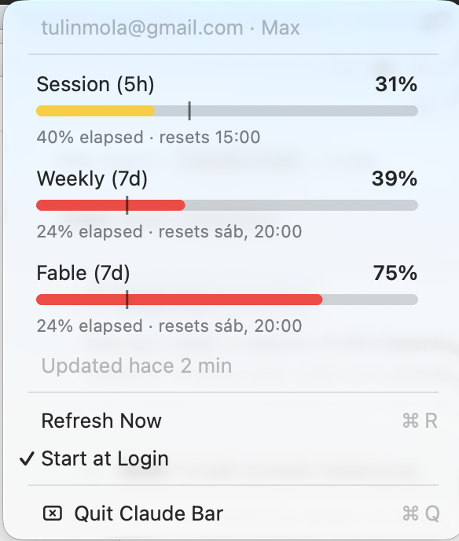
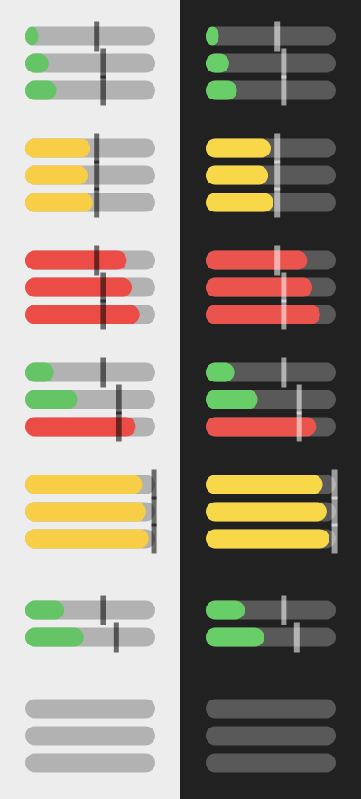

# Claude Bar

A dead-simple macOS menu bar app showing Claude Code rate limits as tiny
horizontal bars: Session (5h) on top, Weekly (7d) below it, and — if your
account has a per-model weekly sublimit, like Fable — that one at the bottom.
Each bar's length is how much you've spent, and a thin vertical line marks how
far into that window you are (5h for Session, 7 days for the other two).

The color is your **pace**, not the raw level: **green** when your spend sits
comfortably behind the line, **yellow** as it approaches, and **red** once it
passes the line (you're spending faster than the window elapses).

Click for the signed-in account and a full-size meter per limit — spend,
how much of the window has elapsed, and the exact moment it resets ("resets
sáb, 20:00" rather than a vague "in 5d") — plus a manual refresh.




## Reading the bars



Top to bottom, each shown on a light and a dark menu bar:

1. **Comfortable** — spend well behind the line, cushion to spare (green).
2. **Approaching** — spend nearing the line; ease off soon (yellow).
3. **Over pace** — spend past the line, burning faster than the window (red).
4. **Mixed** — session and overall weekly fine while the per-model sublimit is
   already over (green + green + red). This is the case the third bar exists
   for: the sublimit is often what you actually hit first.
5. **Nearly full but on pace** — bars almost full yet still yellow: color tracks
   pace, length tracks spend.
6. **No sublimit** — accounts without a per-model limit show two bars, centered.
7. **No data yet** — empty tracks until the first reading arrives.

## How it works

It reads your usage from the same first-party endpoint Claude Code itself uses
— `GET https://api.anthropic.com/api/oauth/usage` — with the OAuth token from
your login keychain. This is exactly what the `/usage` screen and the
VSCode/Cursor Claude extension's own usage display call; the app just draws it
as bars. No transcript parsing, no estimates: these are the real numbers.

The per-model sublimit comes from the response's `limits` array, matched on
`kind: "weekly_scoped"` rather than on the model's name — so a rename won't
silently blank the bar, and the menu label is whatever the API reports.

Because the data lives only on Anthropic's servers (nothing local caches it),
the app fetches it directly. It works no matter how you use Claude Code —
terminal, VSCode, or Cursor.

### First launch

macOS will ask once for permission to read the `Claude Code-credentials`
keychain item. Click **Always Allow** and it won't ask again. You must have
logged into Claude Code at least once.

## Good citizen

Refreshing is deliberately lazy and power-friendly:

- Polls every ~3 minutes while the Mac is awake, via a run-loop timer. It
  **never wakes a sleeping Mac** (user-space timers fire on the next wake) and
  doesn't keep it awake either — it only opts out of App Nap so the timer isn't
  throttled in the background.
- Immediate refresh on launch, on wake-from-sleep, and when you open the menu
  (throttled to one network call per ~45s).
- No tight loops; idle CPU is effectively zero between polls. Zero
  dependencies, ~450 lines of Swift.
- Read-only: it only ever reads your usage, never makes inference calls.

## Build & install

```sh
make run        # build dist/ClaudeBar.app and launch it
make install    # copy the app to ~/Applications
make preview    # render icon samples to /tmp/claudebar-preview.png
```

Use "Start at Login" in the app's menu to keep it around.

### Code signing (optional, recommended)

By default the app is ad-hoc signed, so its code identity changes on every
build — which means macOS re-prompts for keychain access (the Claude Code
token) each time you rebuild. Sign with a **stable identity** and the "Always
Allow" grant persists across rebuilds. Create an untracked `local.mk`:

```makefile
# 40-char hash from: security find-identity -p codesigning -v
CODESIGN_IDENTITY = XXXXXXXXXXXXXXXXXXXXXXXXXXXXXXXXXXXXXXXX
```

Any Apple Development cert works, or a self-signed "Code Signing" certificate
made in Keychain Access. `local.mk` is gitignored, so your identity stays off
the repo.

## A note on the endpoint

`api/oauth/usage` is first-party (it's what Claude Code's own `/usage` uses)
but not part of the public API reference, so field names could change.
Separately, Anthropic's Feb 2026 ToS update frames third-party use of the
consumer OAuth token as non-compliant; enforcement targets *inference* through
non-official clients, not read-only usage checks like this one. It's your own
account, your own token, read-only — but worth knowing.

## Development

- `ClaudeBar --preview <out.png>` renders icon samples and exits.

## License

[MIT](LICENSE)
